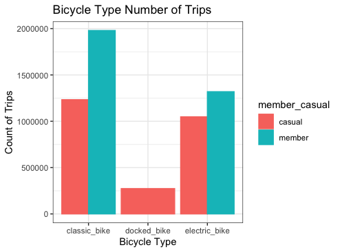
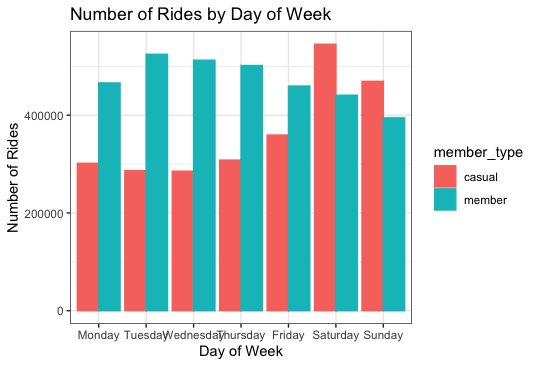
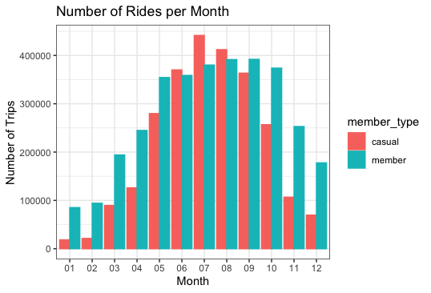

# **Cyclistic Bike Share - Maximizing Annual Membership**

## Background & Business Question

Launched in 2016, Cyclistic is a successful point-to-point bike-share
program consisting of 5,824 geo-tracked bicycles and 692 locking
stations across Chicago.

Historically, Cyclistic's marketing strategy has focused on increasing
public awareness and appealing to a broad market. Flexible pricing plans
are core to this strategy and three purchasing tiers are currently
offered; (1) single-ride, (2) full-day, and (3) annual memberships.

Cyclistic financial analysts have concluded annual members are the most
profitable member segment. Cyclistic believes maximizing the number of
annual memberships, by converting single-ride and full-day users to
annual members will drive revenue growth.

*This study seeks to answer the question - how does Cyclistic bicycle
use differ between annual members and casual riders?*

## Data Preparation

Cyclistic ride data is available at the following link:
<https://divvy-tripdata.s3.amazonaws.com/index.html>.

This study utilizes data collected between June 2021 and May 2022
('202106-divvy-tripdata.csv' --> '202205-divvy-tripdata.csv'). Files
were loaded into R-Studio Desktop for analysis and renamed to improve
readability.

```{r}
data_2021_06 <- read.csv("202106-divvy-tripdata.csv")
data_2021_07 <- read.csv("202107-divvy-tripdata.csv")
data_2021_08 <- read.csv("202108-divvy-tripdata.csv")
data_2021_09 <- read.csv("202109-divvy-tripdata.csv")
data_2021_10 <- read.csv("202110-divvy-tripdata.csv")
data_2021_11 <- read.csv("202111-divvy-tripdata.csv")
data_2021_12 <- read.csv("202112-divvy-tripdata.csv")
data_2022_01 <- read.csv("202201-divvy-tripdata.csv")
data_2022_02 <- read.csv("202202-divvy-tripdata.csv")
data_2022_03 <- read.csv("202203-divvy-tripdata.csv")
data_2022_04 <- read.csv("202204-divvy-tripdata.csv")
data_2022_05 <- read.csv("202205-divvy-tripdata.csv")
```

I attempted to complete this project using Google Sheets and
BigQuery but was limited by file size restrictions, slow processing
speed, and crashes. R-Studio Desktop was the only free environment
available to process 100MB+ files efficiently.

The following libraries were used to process data - tidyverse for data
cleaning, lubridate for date manipulation, hms for time manipulation,
and data.table for exporting.

```{r}
library(tidyverse) #data cleaning
library(lubridate) #date manipulation
library(hms) #time manipulation
library(data.table) #exporting data
```

## Data Processing

### Data Manipulation

Monthly data files were combined into a single data frame consisting of 12 months of data. Individual files were then dropped to clean up the
environment. A copy of the data frame was created to preserve data
integrity.

```{r}
#merge files into a single df 
data_12_months <- rbind(data_2021_06, data_2021_07, data_2021_08, data_2021_09, data_2021_10, data_2021_11, data_2021_12, data_2022_01, data_2022_02, data_2022_03, data_2022_04, data_2022_05) 

#drop monthly files from the environment
remove(data_2021_06, data_2021_07, data_2021_08, data_2021_09, data_2021_10, data_2021_11, data_2021_12, data_2022_01, data_2022_02, data_2022_03, data_2022_04, data_2022_05)

#copy df
data_12_months_2 <- data_12_months 
```

Columns for ride length (ride_length) and day of the week (day_of_week)
were created.

```{r}
#create column ride_length in minutes
data_12_months_2$ride_length <- difftime(data_12_months_2$ended_at, data_12_months_2$started_at, units = "mins")

#create column day_of_week in text
data_12_months_2$day_of_week <- wday(data_12_months_2$started_at)
```

I also added numeric columns for date, month, day, year, and season.

```{r}
#create numeric columns for the day of week, date, month, day, year
data_12_months_2$date <- as.Date(data_12_months_2$started_at)
data_12_months_2$day_of_week <- format(as.Date(data_12_months_2$date), "%A")
data_12_months_2$month <- format(as.Date(data_12_months_2$date), "%m") 
data_12_months_2$day <- format(as.Date(data_12_months_2$date), "%d")
data_12_months_2$year <- format(as.Date(data_12_months_2$date), "%Y")

#create a column for ride season classification
data_12_months_2 <- data_12_months_2 %>% mutate(season = 
  case_when(month == "03" ~ "Spring",
            month == "04" ~ "Spring",
            month == "05" ~ "Spring",
            month == "06" ~ "Summer",
            month == "07" ~ "Summer",
            month == "08" ~ "Summer",
            month == "09" ~ "Fall",
            month == "10" ~ "Fall",
            month == "11" ~ "Fall",
            month == "12" ~ "Winter",
            month == "01" ~ "Winter",
            month == "02" ~ "Winter")
)
```

### Data Cleaning

The raw data contained duplicates, null values, and
invalid values that were cleaned. The raw data also contains
unneeded data such as ride IDs, station IDs, and latitude and
longitude coordinates (latitude and longitude patterns would be
interesting to explore in a future project).

These issues are addressed by the code below.

```{r}
#remove duplicate rows
data_12_months_2 <- distinct(data_12_months_2)

#remove rows with null values
data_12_months_2 <- na.omit(data_12_months_2)

#remove rows where ride_length is <= to zero
data_12_months_2 <- data_12_months_2[!(data_12_months_2$ride_length <=0),]

#remove unneeded columns
data_12_months_2 <- data_12_months_2 %>%  
  select(-c(ride_id, start_station_id, end_station_id, start_lat, start_lng, end_lat, end_lng))
```

The column name member_casual is misleading since the possible values are both "member" and "casual". I renamed this column member_type.

```{r}
#rename member_casual to member_type
data_12_months_2 <- data_12_months_2 %>% 
  rename(member_type = member_casual)
```

Finally, I converted ride_length from a character to a numeric value and
viewed the final data frame.

```{r}
#convert ride_length to numeric
data_12_months_2$ride_length <- as.numeric(as.character(data_12_months_2$ride_length))
is.numeric(data_12_months_2$ride_length)

#view final df
View(data_12_months_2)
```

## Data Analysis & Visualization

Visualizations were made in R-studio using the ggplot2 library. Due to a large number of rows in the data set (n = 5,855,094), ggplot2 defaulted to labeling axes in scientific notation. The code below overrides this default.

```{r}
#converts values from scientific notation 
options(scipen = 999)
```

The total number of rides taken during the period of study was
approximately 5.9 million.

```{r}
#total number of rides
nrow(data_12_months_2)

#total number of rides rounded
round(nrow(data_12_months_2), digits = -5)
```

2,555,431 of these rides were casual rides (single ride or full day) and
3,299,663 rides were taken by members.

```{r}
#count member types
data_12_months_2 %>% count(member_type)
```

3,213,333 rides were taken on classic style bicycles, 273,550 riders
utilized docked bicycles, and 2,368,211 riders utilized electric-assisted bicycles.

```{r}
#total rides by bike type
data_12_months_2 %>%
  group_by(rideable_type) %>% 
  count(rideable_type)
```

This data is plotted below. 

```{r}
#plot bicycle type by number of rides
data_12_months_2 %>%
  group_by(rideable_type, member_type) %>%
  dplyr::summarize(count_trips = n()) %>%  
  ggplot(aes(x=rideable_type, y=count_trips, fill=member_type, color=member_type)) +
  geom_bar(stat='identity', position='dodge') +
  theme_bw()+
  labs(title="Number of Trips by Bicycle Type", x="Bicycle Type", y="Number of Rides")
```



Casual riders used all three bike styles - 1,233,228 casual
rides were taken on classic bicycles, 273,550 on docked bicycles, and
1,048,653 on electric-assisted bicycles.

Members used classic bicycles in 1,980,105 cases and electric-assisted bicycles in 1,319,558 cases. No data indicates docked
bicycle use by a member.

```{r}
#total rides by bike type by member type 
data_12_months_2 %>%
  group_by(member_type, rideable_type) %>% 
  count(rideable_type)
```

The average ride was 19.37 mins. and the median ride was 11.33 mins. The
shortest ride taken was 0.02 mins or 1.2 seconds - an erroneous data point. The longest ride taken was 55,944.15 mins. or
approximately 39 days. It is unclear if this is also an erroneous data point or if a customer was using a bicycle as a temporary replacement for another mode of transportation (for example, a broken-down vehicle).

```{r}
#min, max, median, mean length of ride
summary(data_12_months_2$ride_length)
```

For this report, I defined a week as Monday through Sunday. The number of rides per day, by member type, is plotted below. Members were more active than casual riders Monday through Friday but casual users were more active on weekends.

The most popular day for casual users is Saturday, for members the most popular day is Tuesday.

```{r}
#arrange days of the week in order
data_12_months_2$day_of_week <- ordered(data_12_months_2$day_of_week, levels=c("Monday", "Tuesday", "Wednesday", "Thursday", "Friday", "Saturday", "Sunday"))

#plot number of rides by day of week
data_12_months_2 %>% 
  group_by(member_type, day_of_week) %>%
  dplyr::summarize(count_trips = n()) %>%  
  ggplot(aes(x= day_of_week, y=count_trips, fill=member_type, color=member_type)) +
  geom_bar(stat='identity', position = 'dodge') +
  theme_bw()+
  labs(title ="Number of Rides by Day of Week", x = "Day of Week", y = "Number of Rides")
```



I also plotted the number of rides per month, by member type. The summer months, particularly July and August, were the most popular for casual users. Members used bicycles at a higher rate than casual users from September through May. Member use was more consistent than casual use from May through October.

```{r}
#arranges months in order
data_12_months_2$month <- ordered(data_12_months_2$month, levels=c("01", "02", "03", "04", "05", "06", "07","08","09","10","11","12"))

#plot number of rides per month
data_12_months_2 %>%
  group_by(member_type, month) %>%
  dplyr::summarize(count_trips = n()) %>%  
  ggplot(aes(x= month, y=count_trips, fill=member_type, color=member_type)) +
  geom_bar(stat='identity', position = 'dodge') +
  theme_bw() +
  labs(title ="Number of Rides per Month", x = "Month", y = "Number of Trips")
```



Filtering the data by season provides a higher-level picture. Summer is the most popular season for all users (2,353,948 rides), followed by fall (1,745,818 rides), spring (1,288,747 rides), and winter (466,581 rides).

Filtering by season and user type provides even greater resolution.

```{r}
#---------- Seasonal Use ----------

#total rides by member type
data_12_months_2 %>%
  group_by(season, member_type) %>% 
  count(season)

#total rides
data_12_months_2 %>%
  group_by(season) %>% 
  count(season)
```

I attempted plotting use by the hour, and by day of the week, but my machine was unable to process the code below.

```{r}
#Bike use by the hour, by day of the week
ggplot(data = data_12_months_2) +
  aes(x = started_at, fill = member_type) +
  facet_wrap(~day_of_week) +
  geom_bar() +
  labs(x = 'Start Hour', y = 'Number of Rides', fill = 'Member Type', title = 'Bike Use By Hour, By Day') +
  theme(axis.text = element_text(size = 5))
```
*machine couldn't process code :(*

The top 5 start stations for casual users can be viewed below. Casual user start stations seem to predominately be in the vicinity of tourist attractions.

```{r}
#Find popular start station for casual riders
data_12_months_2 %>%
  group_by(member_type, start_station_name) %>%
  dplyr::summarise(number_of_ride = n()) %>%
  filter(start_station_name != "", "casual"== member_type) %>%
  arrange(-number_of_ride) %>%
  head(n=5) %>%
  select(-member_type)
```

The top 5 start stations for members can be viewed below.

```{r}
#Find popular start station for member riders
data_12_months_2 %>%
  group_by(member_type,start_station_name) %>%
  dplyr::summarise(number_of_ride = n()) %>%
  filter(start_station_name != "", "member" == member_type) %>%
  arrange(-number_of_ride) %>%
  head(n=5) %>%
  select(-member_type)
```

## Recommendations

The business question this study seeks to answer is, how does bicycle use differ between annual members and casual riders?

I would recommend the following to increase member use.

* Phase out docked bicycles - build a fleet of classic and electric-assist bicycles only.
* Invest in start and end stations outside of tourist districts. Particularly the top 5 listed above.
* Conduct marking outreach to local employers to encourage their employees to commute by bicycle.
* Increase marketing during late Spring and early Summer to maximize summer use.
* Offer casual users a promotional upgrade to full membership status. Target these promotions to the most popular start and end stations for casual users.

## Resources and Inspiration

Special thanks to Itamar on
[Kaggle.com](https://www.kaggle.com/code/itamargn/cyclistic-case-study/report),
Joe Yong on
[Medium](https://medium.com/@joeanselmyz/google-data-analytics-case-study-1-using-rstudio-7c552ab63aa3),
and Kelly Adams at
[kellyjadams.com](https://www.kellyjadams.com/post/google-capstone-project#viewer-uqmh)
for publishing excellent case studies I was able to use for
inspiration and assistance.

